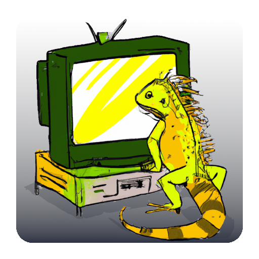

# Proxy: Head



_Proxy: Head_ is an application that provides a very basic screen to other applications. It's primary focus is to give
people the ability to _quickly_ get visuals out of their program so they can more easily create libraries for graphical
applications without always rewriting the same code for opening windows cross-platform, dropping some pixels in and so on.

## Features

- Displays bitmap graphics via shared memory
- Supports basic mouse and keyboard input
- Supports several graphics formats
  - 16, 24 and 32 bit rgb color formats
  - 8 bit indexed mode
- Flexible head resolution
- User-configurable palette for indexed mode

There are always some improvements to do. Check out [the issue list](https://github.com/MasterQ32/proxy-head/labels/enhancement) to see what's left to do.  
Feel free to just implement them!

## Usage Example

This is a basic usage example. For a more complete one, check out [src/demo.zig](src/demo.zig).

```zig
const std = @import("std");
const ProxyHead = @import("ProxyHead");

pub fn main() !void {
    var client = try ProxyHead.open();
    defer client.close();

    // now you can access:
    // - client.input (provides you with the current state of input)

    const fb = try client.requestFramebuffer(.rgbx8888, 800, 600, 200 * std.time.ns_per_ms);

    // now you can access
    // - fb.base   (pointer to the first pixel)
    // - fb.width  (width of the framebuffer)
    // - fb.height (height of the framebuffer)
    // - fb.stride (size of a single row in pixels)

    // Now fill the screen with a nice pattern:
    var row = fb.base;
    for (0..fb.height) |y| {
        for (0..fb.width) |x| {
            row[x] = .{
                .r = @truncate(u8, x),
                .g = @truncate(u8, y),
                .b = 0x00,
            };
        }
        row += fb.stride;
    }

    std.time.sleep(10 * std.time.ns_per_s);
}
```
